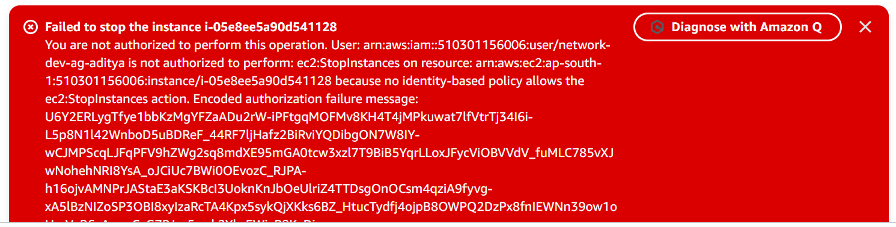

# Cloud Security with AWS IAM

## Summary
Created IAM users, groups, and policies to control access to EC2 instances based on resource tags. Tested access restrictions using a dev IAM user.

## Services Used
- IAM
- EC2

## What I Did
- Launched two EC2 instances:
  - One tagged as `Env: production`
  - One tagged as `Env: development`
- Created a custom IAM policy using JSON
  - Allowed EC2 actions only on resources with `Env: development`
- Created an IAM group and user
- Attached the policy to the group
- Logged in using the IAM user credentials
- Tested:
  - ✅ Could stop the development instance
  - ❌ Could not stop the production instance (permission denied)

## Screenshot

