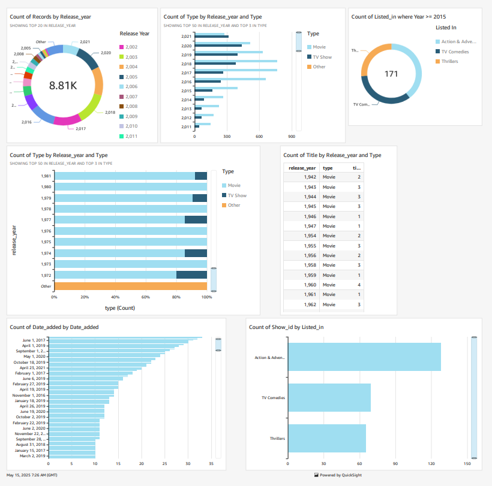

# Data Visualization with Amazon QuickSight

## Summary
Used Amazon QuickSight to visualize Netflix dataset stored in S3. Created charts and dashboards with filters for better analysis.

## Services Used
- QuickSight
- S3

## What I Did
- Uploaded `netflix_titles.csv` and `manifest.json` to S3
- Edited `manifest.json` to point to the CSV file's S3 path
- Connected S3 data to QuickSight
- Created:
  - Donut chart: Top 20 release years
  - Bar chart: Count of movies/TV shows per year by type
- Applied filters for genres like Action, Comedy, Thriller
- Published and exported the dashboard as PDF

## Screenshot

