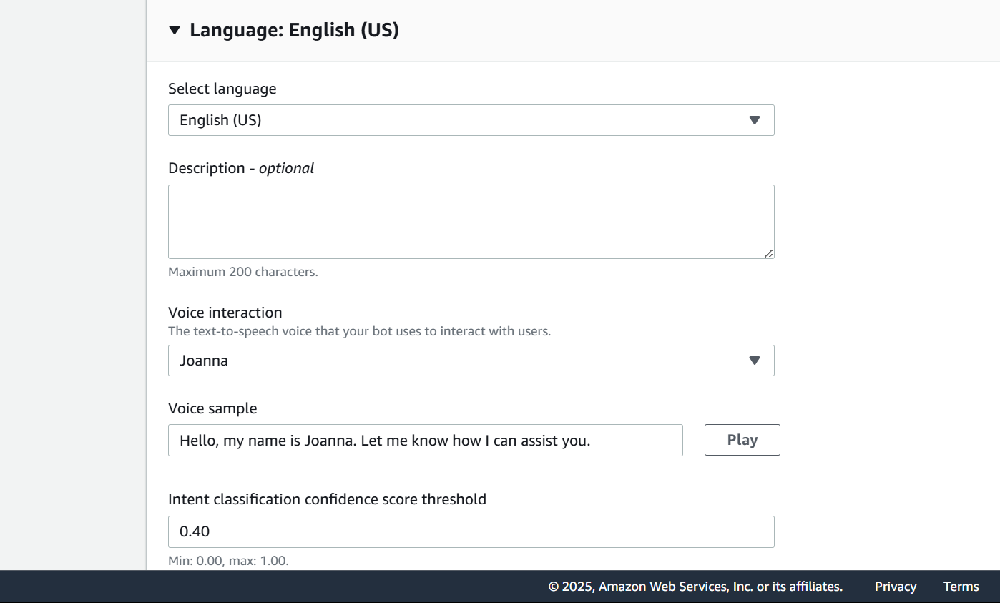
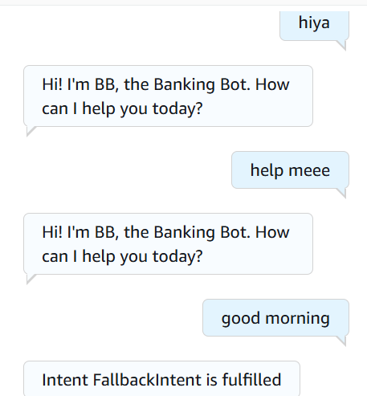
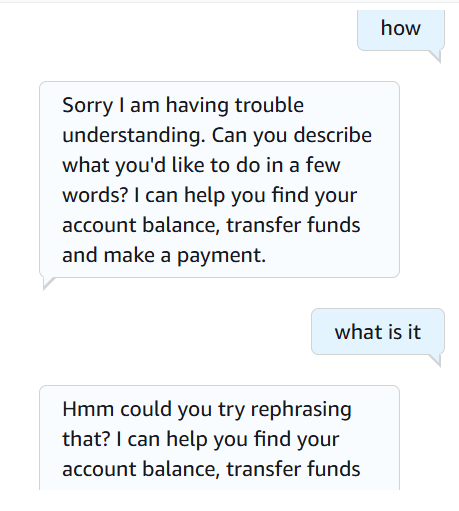

# 🤖 Amazon Lex: Basic Greeting Bot

## Summary
Created a simple chatbot using Amazon Lex that responds to a greeting intent with a static message.

## What I Did
- Created a bot with a "WelcomeIntent"
- Added sample utterances like “hi”, “hello”
- Used Lex fallback intent to handle unmatched input
- Tested the interaction via Lex console

## Services Used
- Amazon Lex (v2)

## Key Concepts
- Intents and utterances
- Lex fallback handling
- Basic bot setup flow

## 📸 Screenshots

### Lex Bot Setup Overview

### Welcome Intent Configuration

### Fallback Intent Definition

