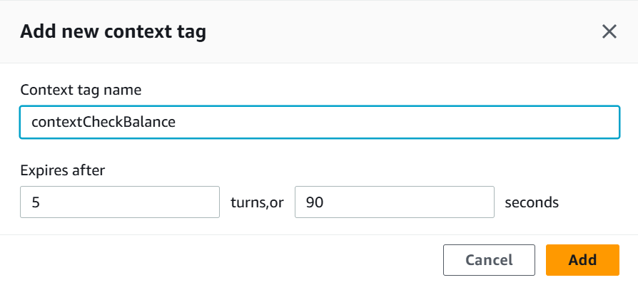
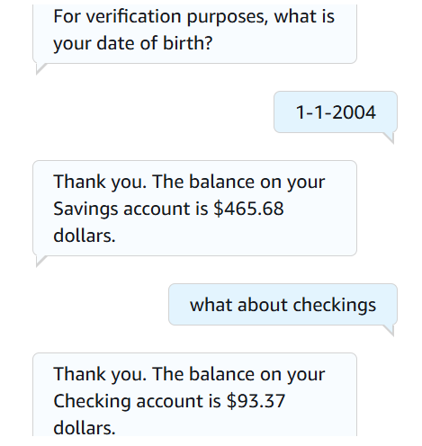
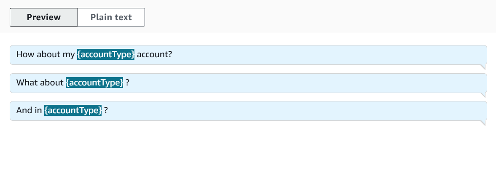

# 🧠 Amazon Lex: Context Switching Between Intents

## Summary
Enabled context switching so the bot could switch between unrelated intents mid-conversation.

## What I Did
- Added multiple intents (e.g., greet, book, exit)
- Used `AMAZON.FallbackIntent` to catch mismatches
- Controlled flow with Lambda code and session state
- Handled "yes"/"no" follow-ups properly

## Services Used
- Amazon Lex
- AWS Lambda

## Key Concepts
- Fallback and context switching
- Session state handling
- Intent chaining and redirection

## 📸 Screenshots

### Adding Context Tags to Intents

### Chatbot Test Showing Intent Switching

### Follow-up Utterances for Flow Control

