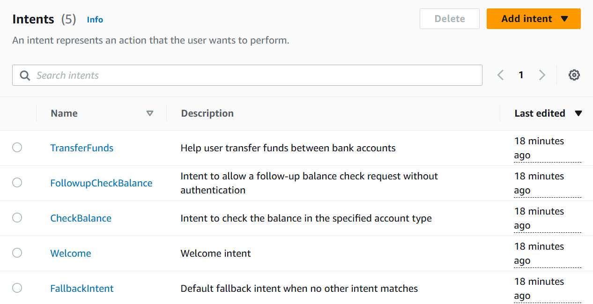
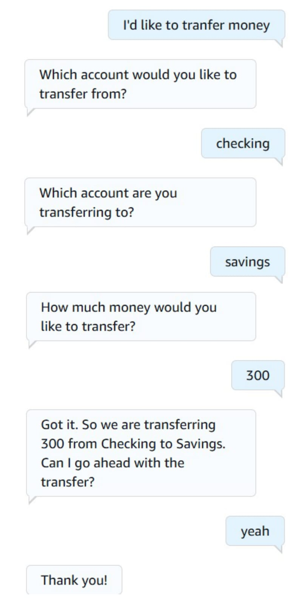

# 💬 Amazon Lex: Enhanced Response Experience

## Summary
Improved the bot's conversational quality with customized fulfillment messages, reprompts, and formatted responses.

## What I Did
- Updated Lambda function to return rich messages
- Used conditional replies based on slot values
- Added clarification prompts and retry logic
- Provided personalized responses

## Services Used
- Amazon Lex
- AWS Lambda

## Key Concepts
- Conditional logic in Lambda
- Customizing Lex fulfillment messages
- User experience design in chatbot flows

## 📸 Screenshots

### Intents List with Fulfillment Setup

### Chatbot Test: Account Transaction Interaction

