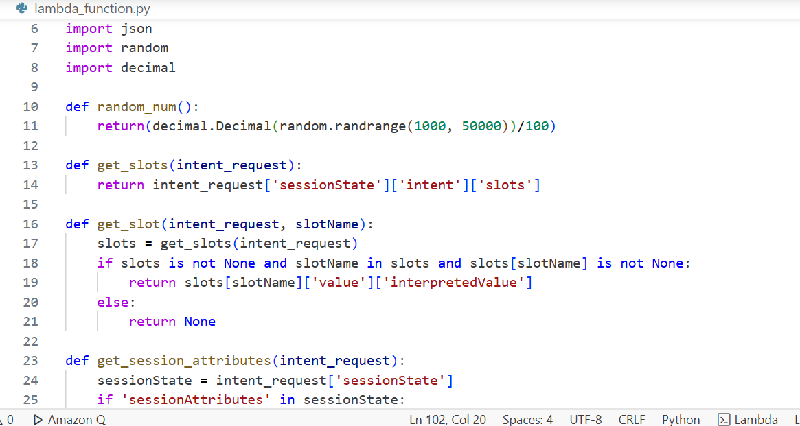
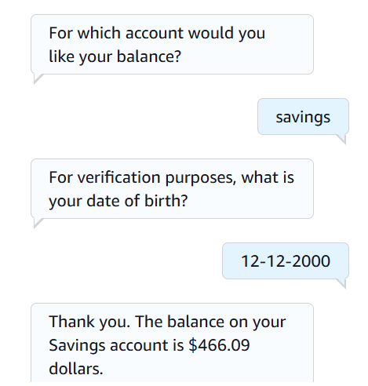

# 🔄 Amazon Lex + AWS Lambda Integration

## Summary
Connected the Lex bot to a Lambda function to dynamically process user input and return custom responses.

## What I Did
- Created a Lambda function for Lex fulfillment
- Wrote logic to parse Lex event input and return messages
- Granted Lex permission to invoke the function
- Integrated Lambda with Lex and tested the flow

## Services Used
- Amazon Lex
- AWS Lambda
- IAM

## Key Concepts
- Lex event structure (JSON)
- Lambda handler response format
- Dynamic, logic-based responses from backend

## 📸 Screenshots

### Lambda Function Code for Fulfillment

### Test Result Showing Lambda-Based Response

