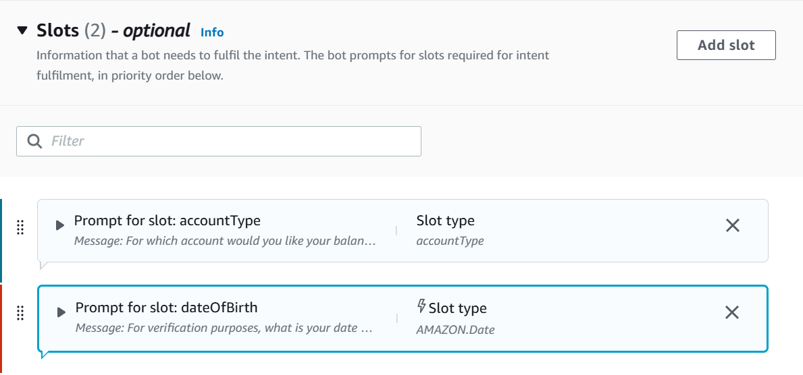
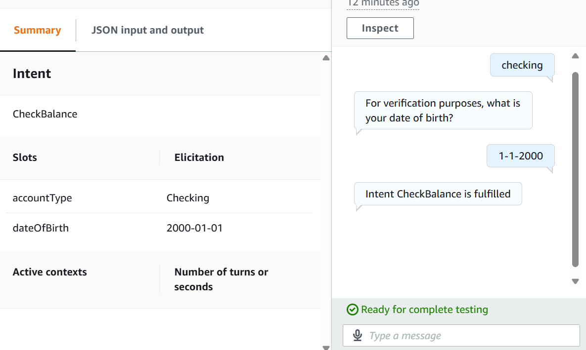

# 🗣️ Amazon Lex: Slot Elicitation for Booking

## Summary
Enhanced the bot to collect user input using slots — specifically for booking use case (e.g., collecting name, date).

## What I Did
- Added a new intent (e.g., “BookAppointment”)
- Created slots like Name, Date, and Time
- Configured prompts to elicit slot values
- Defined confirmation and fulfillment messages

## Services Used
- Amazon Lex

## Key Concepts
- Slot elicitation process
- Slot types and prompt ordering
- Fulfillment message logic

## 📸 Screenshots

### Slot Configuration for BookAppointment Intent

### Chat Flow Demonstrating Slot Capture

