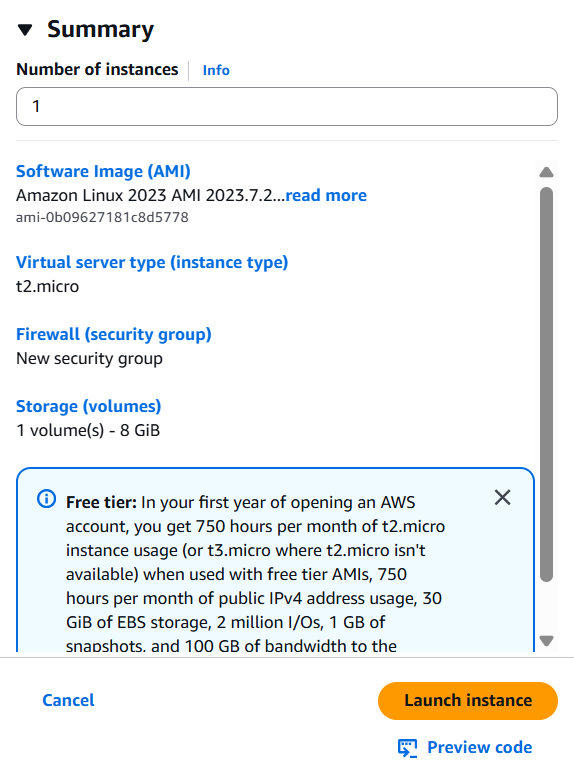

# ⚡ Create an Amazon Aurora Database Cluster

## Summary
Set up an Amazon Aurora cluster and prepared an EC2 instance to connect and manage the database.

## What I Did
- Created an Aurora MySQL-compatible cluster
- Set up an EC2 instance with SSH access
- Used key pair and DNS to prepare for DB access
- Observed failover and replica handling in Aurora

## Services Used
- Amazon Aurora (MySQL)
- EC2
- Key Pair & VPC Setup

## Key Concepts
- Aurora = High availability + scaling
- EC2 is required for accessing private databases
- DNS & key pair are essential for secure remote access

## 📸 Screenshot

### Aurora Cluster Summary Panel

