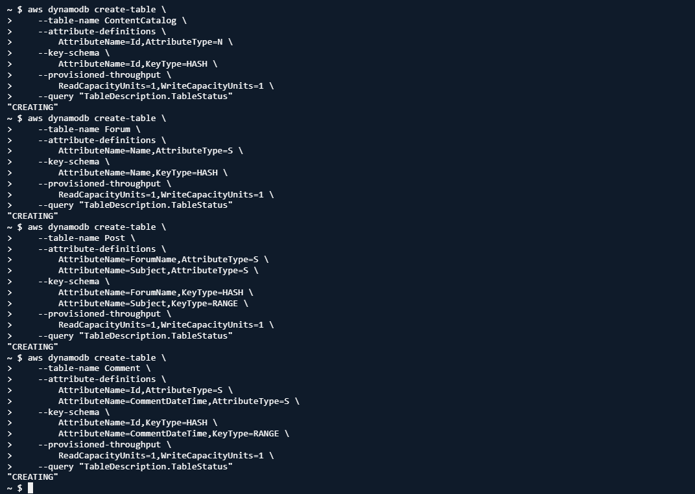
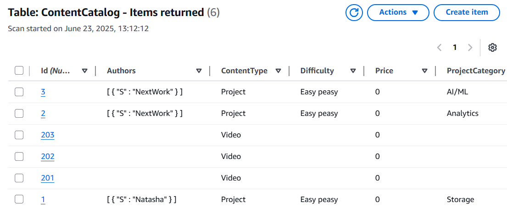
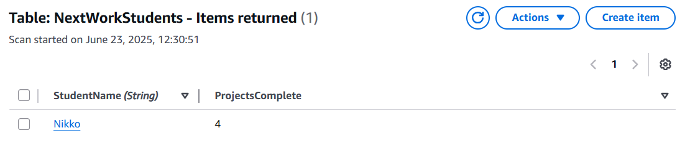

# 📦 Load Data into DynamoDB via CloudShell & CLI

## Summary
Created and populated DynamoDB tables using AWS CLI from CloudShell.

## What I Did
- Created 4 tables: ContentCatalog, Forum, Post, Comment
- Used `batch-write-item` with local JSON files
- Explored table attributes manually in the console

## Services Used
- Amazon DynamoDB
- AWS CLI
- CloudShell

## Key Concepts
- NoSQL data model: items + attributes
- Batch write for efficient uploads
- Table design using partition keys

## 📸 Screenshots

### CLI Command to Create DynamoDB Tables

### Sample Data - ContentCatalog Table

### Sample Data - Students Table

