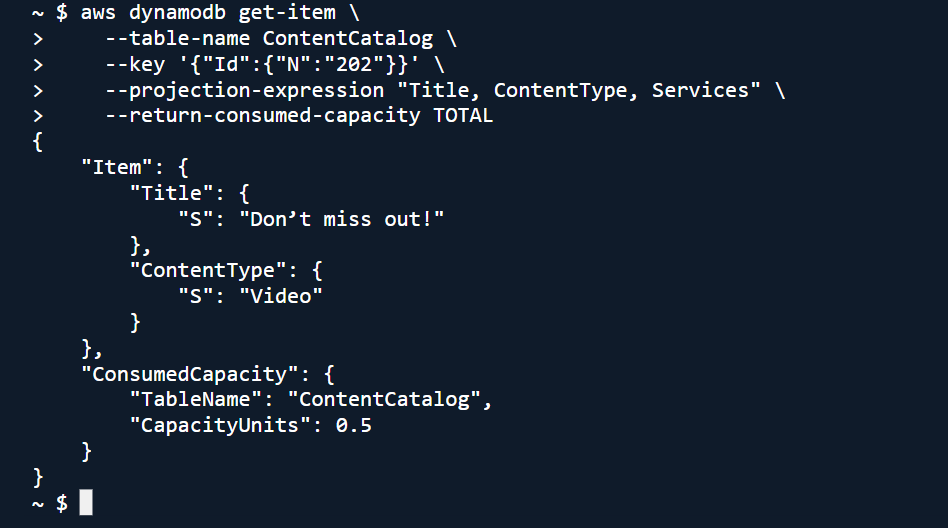
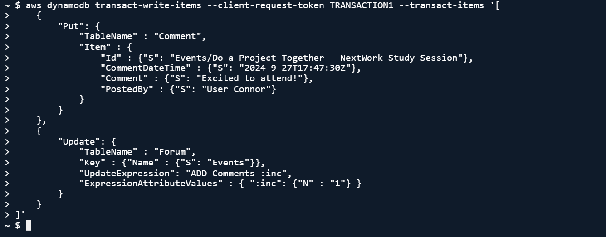
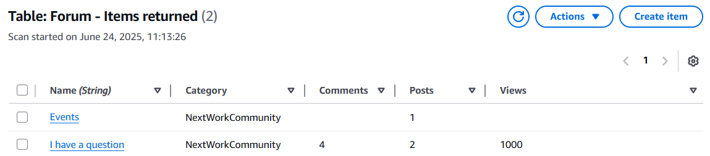

# 🔍 Query and Update Data in DynamoDB

## Summary
Ran queries, projections, and transactions on DynamoDB tables using CLI.

## What I Did
- Queried tables using partition + sort keys
- Explored query filters like projection expressions
- Used `TransactWriteItems` to update multiple tables in one call

## Services Used
- Amazon DynamoDB
- AWS CLI
- CloudShell

## Key Concepts
- Query vs scan
- Strongly consistent reads
- Atomic transactions in NoSQL

## 📸 Screenshots

### Query to Retrieve an Item

### Transaction Command (TransactWriteItems)

### Sample Data from Forum Table

