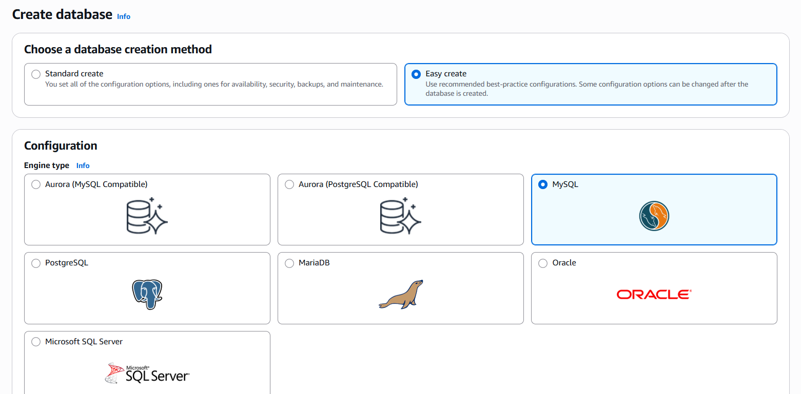
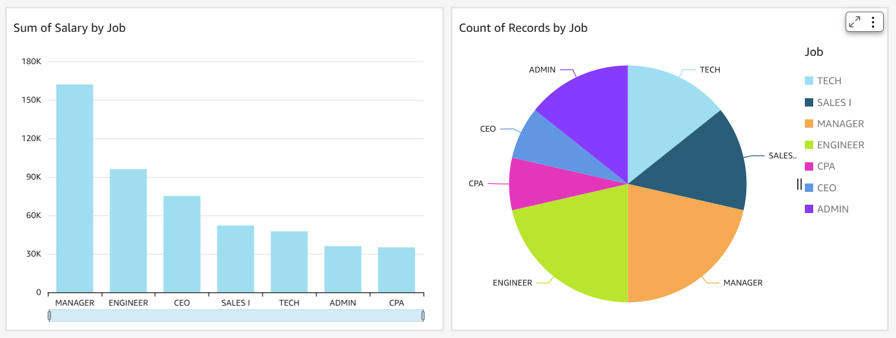
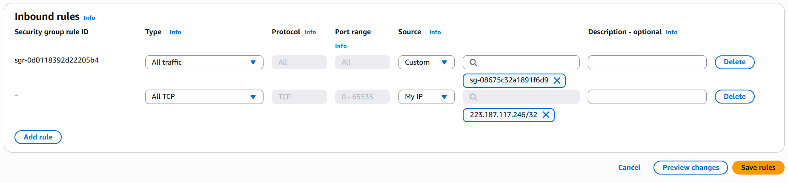

# 🗃️ Visualize a Relational Database with RDS & QuickSight

## Summary
Created an RDS MySQL database, inserted sample data via MySQL Workbench, and visualized it using Amazon QuickSight.

## What I Did
- Created a MySQL database with Amazon RDS
- Made it public initially to connect via Workbench
- Inserted data using SQL statements
- Then secured the instance using private security group access
- Connected QuickSight securely using VPC/subnet config

## Services Used
- Amazon RDS (MySQL)
- MySQL Workbench
- Amazon QuickSight
- IAM & Security Groups

## Key Concepts
- Difference between public vs private DB access
- Secure QuickSight-to-RDS connection via VPC
- Visualizing structured data

## 📸 Screenshots

### DB creation

### Quicksight Dashboard

### Security Group Rules

