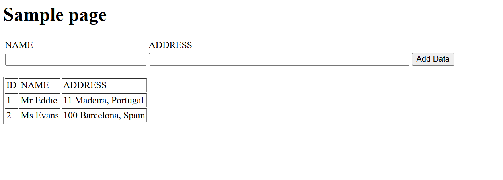
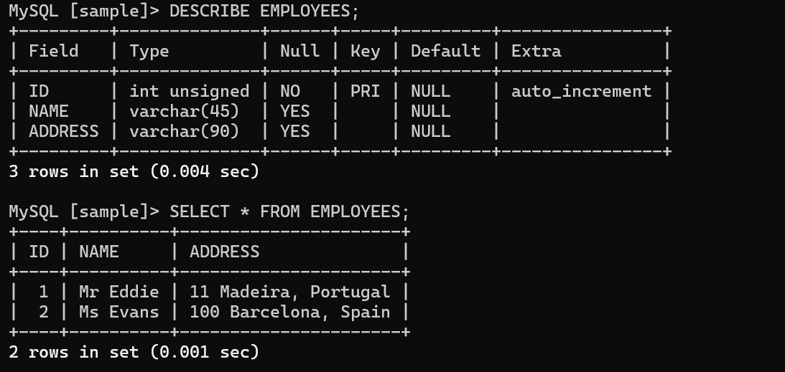

# 🌐 Deploy a Web App Connected to Aurora MySQL

## Summary
Deployed a simple PHP-based web app on EC2 and connected it to the Aurora database created earlier.

## What I Did
- Installed Apache, PHP, MySQL on EC2
- Wrote PHP to connect to Aurora DB
- Tested data insert and fetch via web interface
- Verified connection using CLI and MySQL client

## Services Used
- Amazon Aurora
- EC2 (Apache + PHP)
- MySQL CLI

## Key Concepts
- PHP-MySQL integration
- Private database access from web app
- Web deployment on EC2

## 📸 Screenshots

### Web Application UI Connected to Aurora

### MySQL Database Table (via CLI or PHP Output)

