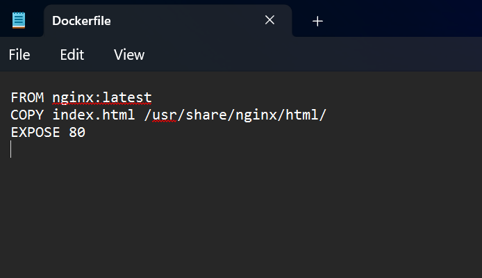
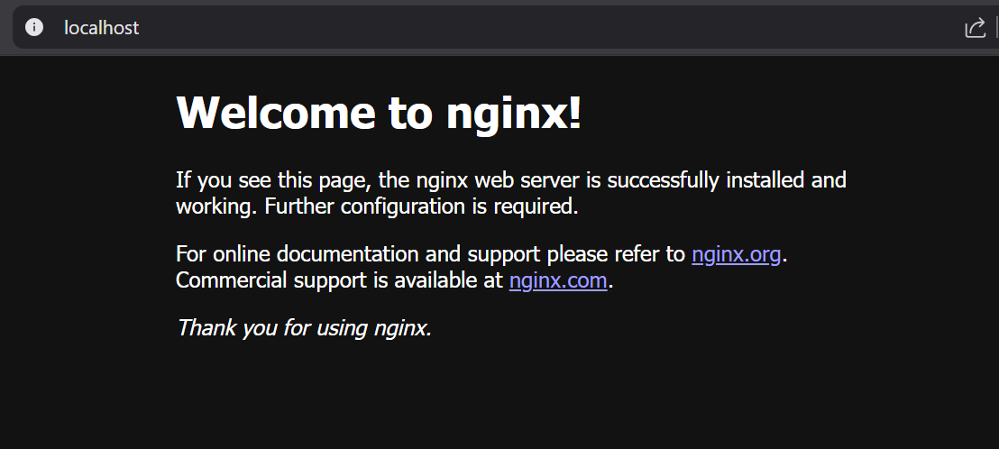
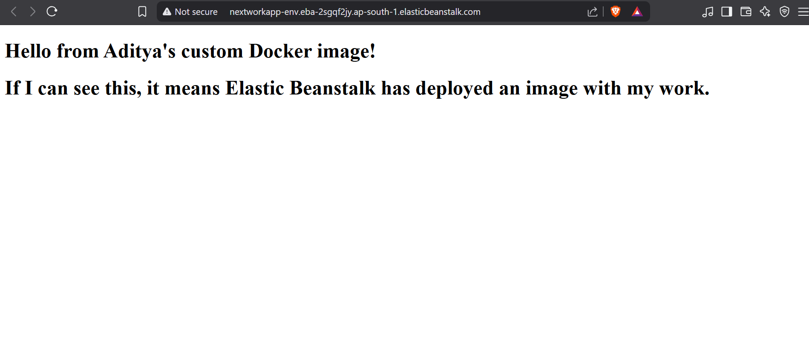

# 🐳 Docker Project: Static Website with Nginx

## Summary
Containerized a static website using Docker and served it through an Nginx web server.

## What I Did
- Wrote a `Dockerfile` using the official Nginx base image
- Copied static HTML content into the container
- Built the Docker image and tagged it
- Ran the container using port mapping (`-p 8080:80`)
- Accessed the site on localhost and confirmed it via the Nginx welcome page

## Tools & Technologies
- Docker CLI
- Nginx
- HTML (static site content)

## Key Concepts
- Creating and customizing a Dockerfile
- Docker image build and container run commands
- Port forwarding and exposing container services
- Local container testing

## 📸 Screenshots

### Dockerfile Configuration

### Nginx Welcome Page Running in Container

### Static Website Running in Browser

