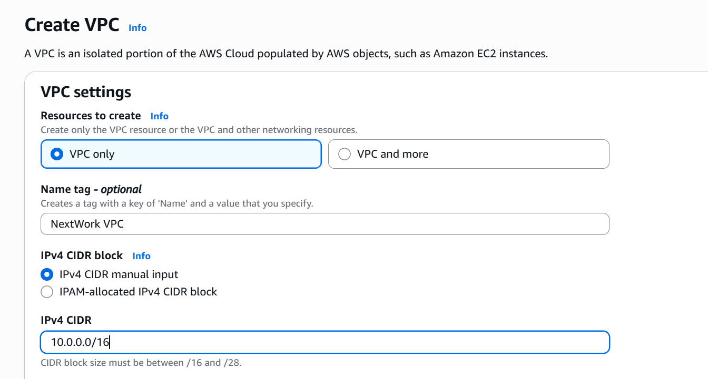
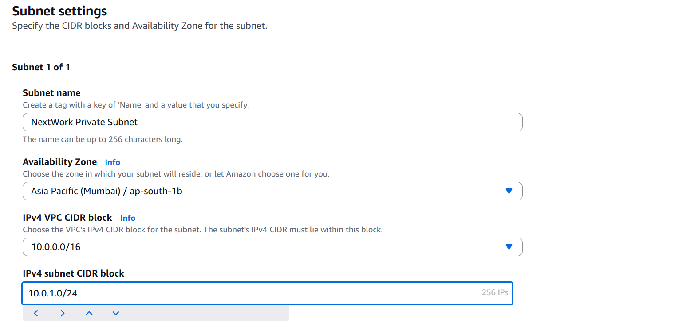

# 🌐 AWS VPC: Step-by-Step Network Architecture Build

This project series demonstrates how I progressively built a complete VPC setup from scratch using AWS. Each step adds a key networking component — starting from a basic VPC to full monitoring with Flow Logs.

---

## 🧱 Steps Covered

### 1. ✅ Create a VPC
- Defined a custom IPv4 CIDR block
- Region: Asia Pacific (Mumbai)
- Used it as the base for all networking resources

### 2. 🧩 Add Subnets
- Created one **public subnet**
- Enabled auto-assign public IP for instances
- Explained public vs private subnets

### 3. 🌐 Attach an Internet Gateway (IGW)
- Created and attached an IGW to the VPC
- Enabled internet access for public subnet

### 4. 🛣️ Set Up Route Tables
- Created a route table with `0.0.0.0/0` → IGW
- Associated it with the public subnet

### 5. 🔐 Configure Security Groups
- Created a Security Group for EC2 access
- Allowed inbound HTTP and SSH
- Understood default outbound allow behavior

### 6. 🚧 Create a Custom Network ACL
- Built custom NACLs with inbound/outbound rules
- Compared with default NACLs
- Understood stateless nature vs stateful SGs

### 7. 📈 Enable VPC Flow Logs
- Created Flow Logs for the VPC to monitor traffic
- Sent logs to CloudWatch Logs
- Learned how to track rejected and accepted traffic

---

## 🛠️ Services Used
- VPC
- Subnets
- Internet Gateway
- Route Tables
- Security Groups
- Network ACLs
- CloudWatch + Flow Logs

---

## 💡 Key Learnings
- Full VPC lifecycle from scratch
- Difference between SG and NACL (stateful vs stateless)
- Role of route tables and gateways in internet access
- Basics of VPC traffic monitoring with logs

---

## 📸 Screenshots

### VPC Setup

### Subnet Configuration

