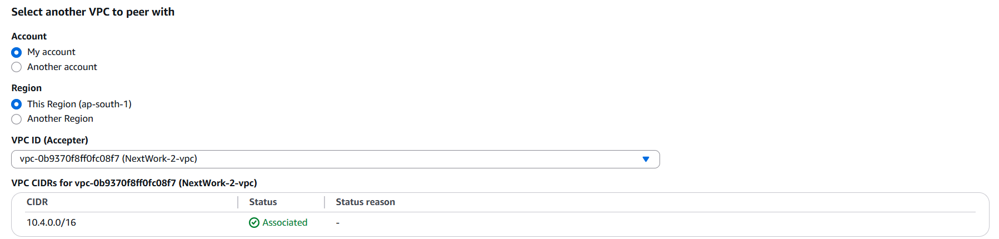
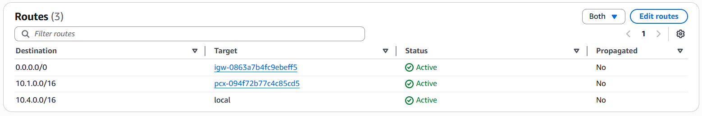
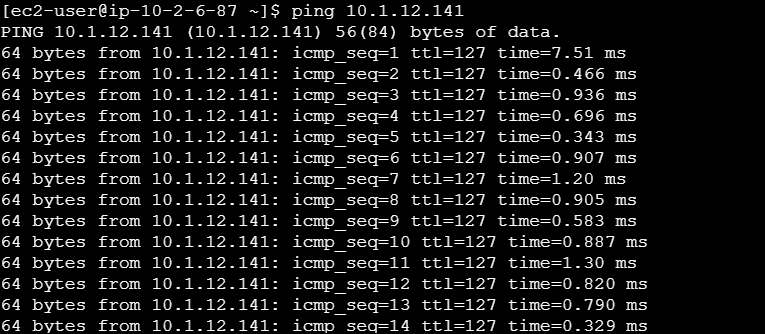

# 🔗 AWS VPC Peering Connection

## Summary
Established a VPC Peering connection between two VPCs to allow private traffic between resources in different networks.

## Services Used
- VPC
- VPC Peering
- Route Tables

## What I Did
- Created a second VPC in the same region
- Set up a **VPC Peering Connection** between the two VPCs
- Updated route tables in both VPCs to allow traffic between CIDR ranges
- Verified connectivity between resources (e.g., ping between EC2 instances)

## Key Concepts
- VPC Peering allows private, secure traffic without public internet
- Routes must be updated in **both VPCs** for communication to work
- Peering is **non-transitive**

## 📸 Screenshots

### VPC Peering Connection Setup

### Updated Route Tables

### Ping Test Between EC2 Instances

