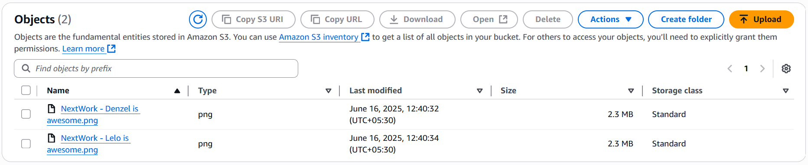
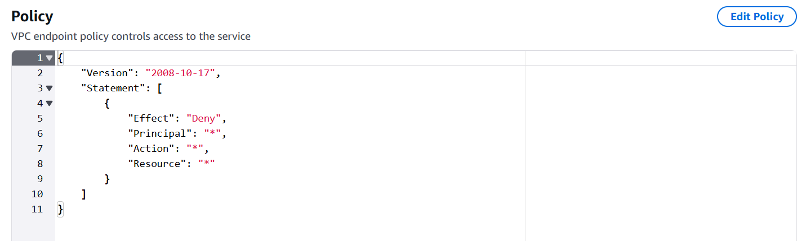

# 📊 AWS VPC Traffic Analysis with Flow Logs & CloudWatch

## Summary
Enabled VPC Flow Logs and analyzed traffic patterns using CloudWatch Logs and Log Insights.

## Services Used
- VPC Flow Logs
- CloudWatch Logs
- CloudWatch Log Insights

## What I Did
- Enabled **Flow Logs** at the VPC level
- Chose CloudWatch Logs as the destination
- Analyzed logs using **CloudWatch Log Insights**
  - Filtered for accepted vs rejected traffic
  - Observed traffic by instance ID, port, and source IP

## Key Concepts
- Flow Logs help monitor network traffic at VPC, subnet, or ENI level
- Rejected traffic can indicate misconfigured security groups or ACLs
- Log Insights provides structured queries for traffic analysis

## 📸 Screenshots

### S3 Bucket for Log Storage

### Log File Structure in S3

### VPC Endpoint Policy Used

